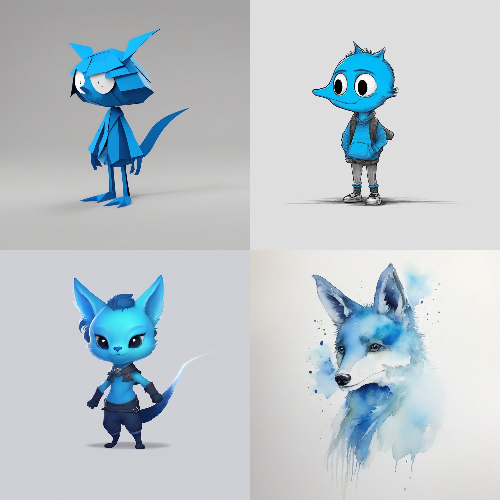

# Generating-Nupzuki-without-its-real-images
Various concepted images of the character “Nupzuki”, generated by an image-to-image pipeline that utilized the SDXL base model output and multiple non-dedicated LoRAs. These LoRAs were intentionally used to create distinct stylistic variations, showcasing design versatility without relying on a dedicated character model.



Our pipeline succesfully generate various “Nupzuki”s!


### How to reproduce our result

```
environment
```

